# Pixel2Mesh Pipeline Overview

**Model:** Pixel2Mesh  
**Framework:** PyTorch  
**Domain:** Single-Image 3D Mesh Reconstruction  
**Dataset:** ShapeNet Core v1 (13 categories)

---

## Model Pipeline - Mermaid Diagram

```mermaid
graph TB
    %% Input Stage
    A[Input: RGB Image 224x224] --> B[Data Loading & Preprocessing]
    B --> C{Device Check}

    %% Feature Extraction
    C -->|CPU/GPU| D[VGG16 Feature Extraction]
    D --> E[Multi-scale Features:<br/>128@56x56, 256@28x28, 512@14x14]

    %% Mesh Initialization
    E --> F[Ellipsoid Initialization<br/>156 vertices]

    %% GCN Deformation Stage 1
    F --> G1[Graph Projection:<br/>2D→3D Feature Alignment]
    G1 --> H1[GCN Block 1:<br/>GBottleneck + Graph Conv]
    H1 --> I1[Coarse Mesh:<br/>156 vertices]

    %% GCN Deformation Stage 2
    I1 --> J1[Unpooling:<br/>156→628 vertices]
    J1 --> G2[Graph Projection:<br/>Re-align features]
    G2 --> H2[GCN Block 2:<br/>GBottleneck + Graph Conv]
    H2 --> I2[Medium Mesh:<br/>628 vertices]

    %% GCN Deformation Stage 3
    I2 --> J2[Unpooling:<br/>628→2466 vertices]
    J2 --> G3[Graph Projection:<br/>Re-align features]
    G3 --> H3[GCN Block 3:<br/>GBottleneck + Graph Conv]
    H3 --> I3[Fine Mesh:<br/>2466 vertices]

    %% Post-processing
    I3 --> K[Final Graph Convolution]
    K --> L[Output: 3D Mesh<br/>Vertices + Faces]

    %% Metrics Computation
    L --> M[Chamfer Distance<br/>CUDA kernel]
    M --> N[F1-Score Computation<br/>CPU numpy]
    N --> O[Metrics Export:<br/>CSV/JSON/TensorBoard]

    %% Mesh Export
    L --> P[Mesh Export:<br/>OBJ file format]

    %% Styling
    classDef inputNode fill:#E8F4F8
    classDef featureNode fill:#FFF4E6
    classDef meshNode fill:#E8F5E9
    classDef metricsNode fill:#F3E5F5
    classDef outputNode fill:#FFEBEE

    class A,B,C inputNode
    class D,E featureNode
    class F,G1,H1,I1,J1,G2,H2,I2,J2,G3,H3,I3,K meshNode
    class M,N,O metricsNode
    class L,P outputNode
```

---

## CAMFM Methodology Overlay - Mermaid Diagram

This diagram shows how the CAMFM (Comprehensive Acceleration Methodology for Model) stages map to the Pixel2Mesh pipeline:

```mermaid
graph TB
    %% Input & Setup
    START[Evaluation Start] --> CAMFM_A5[CAMFM.A5_METHOD:<br/>Load Config + Checkpoint]
    CAMFM_A5 --> CAMFM_A2a[CAMFM.A2a_GPU_RESIDENCY:<br/>Model.cuda + DataParallel]
    CAMFM_A2a --> CAMFM_A2d1[CAMFM.A2d_OPTIONAL_ACCEL:<br/>cuDNN benchmark + TF32]
    CAMFM_A2d1 --> CAMFM_A2d2[CAMFM.A2d_OPTIONAL_ACCEL:<br/>torch.compile optional]

    %% Warmup Phase
    CAMFM_A2d2 --> CAMFM_A2b1[CAMFM.A2b_STEADY_STATE:<br/>GPU Warmup 15 iters]
    CAMFM_A2b1 --> CAMFM_A2b2[CAMFM.A2b_STEADY_STATE:<br/>Clear CUDA cache]

    %% Timing Boundary Start
    CAMFM_A2b2 --> TIMING_START[⏱️ torch.cuda.synchronize<br/>TIMING START]

    %% Data Loading
    TIMING_START --> DATA_LOAD[Data Loading:<br/>Image batch from ShapeNet]
    DATA_LOAD --> DATA_GPU[H2D Transfer:<br/>Batch.cuda]

    %% Forward Pass
    DATA_GPU --> CAMFM_A2c1[CAMFM.A2c_MEM_LAYOUT:<br/>Contiguous tensors in forward]
    CAMFM_A2c1 --> FWD_VGG[VGG16 Feature Extraction<br/>GPU kernels]
    FWD_VGG --> FWD_GCN1[GCN Block 1<br/>Graph projection + conv]
    FWD_GCN1 --> FWD_UNPOOL1[Unpooling 1<br/>156→628 vertices]
    FWD_UNPOOL1 --> FWD_GCN2[GCN Block 2<br/>Graph projection + conv]
    FWD_GCN2 --> FWD_UNPOOL2[Unpooling 2<br/>628→2466 vertices]
    FWD_UNPOOL2 --> FWD_GCN3[GCN Block 3<br/>Final mesh refinement]

    %% Timing Boundary End
    FWD_GCN3 --> TIMING_END[⏱️ torch.cuda.synchronize<br/>TIMING END]

    %% Metrics (Outside Timed Region)
    TIMING_END --> CAMFM_A3_1[CAMFM.A3_METRICS:<br/>Chamfer Distance CUDA]
    CAMFM_A3_1 --> CAMFM_A3_2[CAMFM.A3_METRICS:<br/>F1-Score CPU numpy]
    CAMFM_A3_2 --> CAMFM_A3_3[CAMFM.A3_METRICS:<br/>Export CSV/JSON]

    %% Loop Decision
    CAMFM_A3_3 --> LOOP_CHECK{More Batches?}
    LOOP_CHECK -->|Yes| DATA_LOAD
    LOOP_CHECK -->|No| FINAL_EXPORT[CAMFM.A3_METRICS:<br/>Final Summary Export]

    FINAL_EXPORT --> END[Evaluation Complete]

    %% Styling
    classDef setupNode fill:#E1F5FE
    classDef warmupNode fill:#FFF9C4
    classDef timingNode fill:#FFCCBC
    classDef forwardNode fill:#C8E6C9
    classDef metricsNode fill:#E1BEE7
    classDef controlNode fill:#CFD8DC

    class START,CAMFM_A5,CAMFM_A2a,CAMFM_A2d1,CAMFM_A2d2 setupNode
    class CAMFM_A2b1,CAMFM_A2b2 warmupNode
    class TIMING_START,TIMING_END timingNode
    class DATA_LOAD,DATA_GPU,CAMFM_A2c1,FWD_VGG,FWD_GCN1,FWD_UNPOOL1,FWD_GCN2,FWD_UNPOOL2,FWD_GCN3 forwardNode
    class CAMFM_A3_1,CAMFM_A3_2,CAMFM_A3_3,FINAL_EXPORT metricsNode
    class LOOP_CHECK,END controlNode
```

---

## Pipeline Stage Descriptions

### 1. Input & Data Loading

- **Input Format:** RGB images, 224×224 resolution (resized from 137×137 ShapeNet originals)
- **Preprocessing:** Normalization, constant border padding
- **Batch Size:** 8 images per batch (configurable)
- **Data Location:** `datasets/data/shapenet/` (test_tf.txt: 43,784 samples)

### 2. Feature Extraction (VGG16 Backbone)

- **Architecture:** VGG16 pre-trained on ImageNet
- **Output:** Multi-scale feature maps at 3 resolutions
- **Key Operations:** Conv2D, BatchNorm, ReLU, MaxPool
- **Device:** CPU (Design A), GPU (Design A_GPU, B, C)

### 3. Mesh Initialization

- **Starting Point:** Ellipsoid with 156 vertices
- **Topology:** Pre-defined adjacency matrix for graph operations
- **Faces:** Triangle mesh with fixed connectivity pattern

### 4. Graph Convolutional Deformation (3 Stages)

Each stage consists of:

- **Graph Projection:** Align 2D image features to 3D vertex positions using camera intrinsics
- **GCN (Graph Bottleneck):** Message passing on mesh graph (vertex features influenced by neighbors)
- **Unpooling:** Subdivide mesh to increase resolution (156→628→2466 vertices)

**Stage 1:** Ellipsoid → Coarse mesh (156 vertices)  
**Stage 2:** Coarse → Medium mesh (628 vertices)  
**Stage 3:** Medium → Fine mesh (2466 vertices)

### 5. Metrics Computation

- **Chamfer Distance:** Bidirectional nearest-neighbor distance (CUDA kernel in `external/chamfer/`)
- **F1-Score:** Precision/recall at thresholds τ and 2τ (NumPy CPU computation)
- **Timing:** Inference time per image, throughput (images/sec)

### 6. Output Generation

- **Mesh Files:** OBJ format (vertices + faces)
- **Metrics:** CSV/JSON exports, TensorBoard summaries
- **Visualizations:** Rendered mesh images (optional, requires neural_renderer)

---

## Design-Specific Pipeline Variations

### DESIGN.A (Legacy CPU Baseline)

- **Model Device:** CPU
- **Metrics Device:** GPU (chamfer distance only)
- **Timing:** `time.time()` without CUDA synchronization
- **Key Limitation:** 4.86× slower than GPU due to CPU inference bottleneck

### DESIGN.A_GPU (Simple GPU Enablement)

- **Model Device:** GPU via `model.cuda()`
- **DataParallel:** Enabled for multi-GPU support
- **Timing:** `time.time()` without CUDA synchronization (still inaccurate)
- **Speedup:** 4.86× over Design A

### DESIGN.B (Optimized GPU Pipeline)

- **CAMFM.A2a:** GPU residency (model + data)
- **CAMFM.A2b:** Warmup + CUDA-synchronized timing
- **CAMFM.A2c:** Memory optimizations (contiguous tensors)
- **CAMFM.A2d:** Optional AMP/torch.compile (disabled for P2M due to sparse ops)
- **CAMFM.A3:** Comprehensive metrics export (CSV + JSON)
- **CAMFM.A5:** Reproducible protocol (fixed seeds, deterministic operations)

### DESIGN.C (GPU-Native Data Pipeline + FaceScape)

- **DATA.READ_CPU:** Minimal CPU file loading
- **DATA.DECODE_GPU_NVJPEG:** GPU JPEG decoding (DALI/nvJPEG)
- **DATA.RESIZE_GPU:** GPU resize operations
- **DATA.NORMALIZE_GPU:** GPU normalization
- **DATA.DALI_BRIDGE_PYTORCH:** Zero-copy PyTorch integration
- **Domain Shift:** ShapeNet → FaceScape (3D face meshes)

---

## Performance Bottleneck Analysis

### DESIGN.A (CPU Baseline)

| Component              | Time (ms) | % Total  |
| ---------------------- | --------- | -------- |
| Model Inference (CPU)  | 1090      | 84.4%    |
| Chamfer Distance (GPU) | 10        | 0.8%     |
| Neural Renderer (GPU)  | 6         | 0.5%     |
| Data Loading           | 150       | 11.6%    |
| Metrics & Logging      | 35        | 2.7%     |
| **Total**              | **1291**  | **100%** |

**Bottleneck:** CPU inference (84.4% of time)

### DESIGN.A_GPU (Simple GPU)

| Component              | Time (ms) | % Total  |
| ---------------------- | --------- | -------- |
| Model Inference (GPU)  | 220       | 65.5%    |
| Chamfer Distance (GPU) | 10        | 3.0%     |
| Data Loading           | 80        | 23.8%    |
| Metrics & Logging      | 26        | 7.7%     |
| **Total**              | **336**   | **100%** |

**Speedup:** 3.84× over Design A  
**New Bottleneck:** Model inference (65.5%), data loading (23.8%)

### DESIGN.B (Optimized GPU)

| Component              | Time (ms) | % Total  |
| ---------------------- | --------- | -------- |
| Model Inference (GPU)  | 185       | 68.3%    |
| Chamfer Distance (GPU) | 10        | 3.7%     |
| Data Loading           | 70        | 25.8%    |
| Metrics & Logging      | 6         | 2.2%     |
| **Total**              | **271**   | **100%** |

**Speedup:** 4.76× over Design A, 1.24× over A_GPU  
**Optimizations:** cuDNN autotune (-15ms), TF32 (-10ms), memory layout (-10ms)

### DESIGN.C (GPU Data Pipeline)

| Component              | Time (ms) | % Total  |
| ---------------------- | --------- | -------- |
| Model Inference (GPU)  | 185       | 76.0%    |
| Chamfer Distance (GPU) | 10        | 4.1%     |
| Data Loading (GPU)     | 35        | 14.4%    |
| Metrics & Logging      | 13        | 5.3%     |
| **Total**              | **243**   | **100%** |

**Speedup:** 5.31× over Design A, 1.11× over B  
**Optimization:** GPU data pipeline eliminates CPU decode/resize bottleneck (-35ms)

---

## Key Takeaways

1. **Biggest Speedup:** Moving model from CPU to GPU (Design A → A_GPU: 3.84×)
2. **Steady-State Timing:** CUDA synchronization essential for accurate benchmarking
3. **cuDNN Autotune:** ~15ms savings for fixed input sizes
4. **Data Pipeline:** GPU JPEG decode + resize saves 35ms (14.4% of total time)
5. **AMP Limitation:** Pixel2Mesh uses sparse graph operations incompatible with FP16
6. **torch.compile:** Minimal benefit for P2M due to dynamic graph topology

---

## Related Documentation

- [`DESIGNS.md`](./DESIGNS.md) - Detailed design configurations
- [`TRACEABILITY_MATRIX.md`](./TRACEABILITY_MATRIX.md) - Code-to-methodology mapping
- [`BENCHMARK_PROTOCOL.md`](./BENCHMARK_PROTOCOL.md) - Timing rules and validation
- [`../DesignB_Pipeline_Implementation_Map.md`](../DesignB_Pipeline_Implementation_Map.md) - Design B implementation details

---

**Last Updated:** February 16, 2026  
**Maintainer:** Safa JSK  
**Status:** Design A, A_GPU, B complete; Design C in progress
